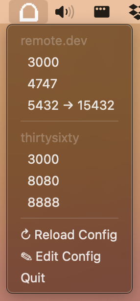

# Tunnelbar

A macOS menubar app that manages SSH tunnels. Click a port under a server name to toggle that tunnel on or off.

<p align="center">
  
</p>

## Install

```bash
git clone https://github.com/bybunni/tunnelbar.git && cd tunnelbar
make install   # runs uv sync
```

Requires Python 3.11+ and [uv](https://docs.astral.sh/uv/).

## Configuration

Edit `~/.config/tunnelbar/config.yaml` (created automatically on first launch):

```yaml
servers:
  - name: remote.dev
    host: remote.dev        # must work with `ssh <host>`
    ports:
      - port: 3000
      - port: 8080
      - port: 5432
        local_port: 15432   # optional: remap to avoid local conflicts

  - name: thirtysixty
    host: thirtysixty
    ports:
      - port: 3000
      - port: 8888
```

`host` should match an entry in your `~/.ssh/config`. Tunnelbar does not manage keys or passwords.

## Usage

```bash
uv run tunnelbar
```

The menubar icon is an arch outline when idle and fills in when any tunnel is active. Click a port to toggle its tunnel. Use **Reload Config** after editing the YAML and **Edit Config** to open it.

## Start on login

```bash
make plist     # installs a launchd agent and loads it
make unplist   # removes it
```

## Troubleshooting

- Logs: `/tmp/tunnelbar.log` and `/tmp/tunnelbar.err`
- If a tunnel fails immediately, check `ssh <host>` works in your terminal
- Port conflicts are reported via macOS notifications
